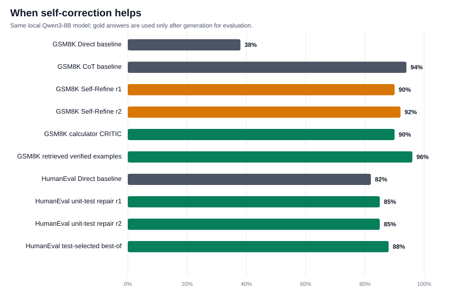

# 第 4–5 周评测报告：自我纠错何时有用

## 实验设置

- 模型：本地 Qwen3-8B Q4，temperature=0。
- 数学：固定 GSM8K 100 题；数值 exact match 判分。
- 代码：HumanEval 前 100 题；官方 `check(candidate)` 单元测试判分。
- 公平性：题目标准答案只在候选答案生成结束后用于统计，不进入 Self-Refine、CRITIC 或代码修复提示。
- 采纳规则：数学 CRITIC 只在模型声明的 `VERIFY` 与 `FINAL` 冲突时重写；代码修复只由单测通过与否决定。



## 关键结果

| 题型 | 纠错反馈 | 纠错轮数 | 方法 | 准确率/通过率 | 相对基线改对 | 相对基线改错 |
|---|---|---:|---|---:|---:|---:|
| GSM8K | 旧版模型自评 | 1 | `self_refine` | 90.0% | 0 | 4 |
| GSM8K | 自评+计算器门控 | 1 | `self_refine_calculator` | 94.0% | 0 | 0 |
| GSM8K | 自评+采纳门控 | 1 | `self_refine_gate` | 94.0% | 0 | 0 |
| GSM8K | 计算器 | 1 | `critic` | 90.0% | 2 | 6 |
| HumanEval | 单元测试 | 1 | `code_self_repair` | 85.0% | 3 | 0 |
| HumanEval | 单元测试 | 2 | `code_self_repair_r2` | 85.0% | 3 | 0 |

基线口径：GSM8K 的纠错基线是 CoT 94%；HumanEval 工具修复基线是 Direct 82%。

## 自评反馈 vs 工具反馈

- 旧版模型自评的 Self-Refine（1 轮）为 90.0%，相对 CoT 改对 0 题、改错 4 题。模型会把听起来合理的自我批评当成事实，因此可能越改越差。
- 计算器门控 Self-Refine（1 轮）为 94.0%，相对 CoT 改对 0 题、改错 0 题。它只在算术被工具证伪时采纳修改。
- 采纳门控 Self-Refine（1 轮）为 94.0%，相对 CoT 改对 0 题、改错 0 题；相对旧版 Self-Refine 挽回 4 个退化案例。
- HumanEval 单测修复为 85%，相对 Direct 改对 3 题、改错 0 题。失败输入、异常和实际输出让反馈可执行，而且通过候选不会被再次改写。
- GSM8K 计算器 CRITIC 只有 90%，没有超过 CoT。计算器能验证算式执行，却不能验证模型是否把自然语言题意翻译成了正确算式，因此外部工具并非天然有效。
- 检索此前已被外部判对的相似解法达到 96%。这说明可靠反馈配合可迁移的上下文，比无依据自评更稳定。

## 研究结论

自我纠错是否有用，关键不在于多生成一轮，而在于反馈是否可靠、具体，并且能在不知道标准答案的情况下决定是否采纳修改。代码题比数学题更容易受益，是因为单元测试同时提供明确的对错信号和定位线索；数学计算器通常只能检查局部算术，无法检查题意建模。

轮数对照为：数学 CoT 0 轮 94%、旧版 Self-Refine 1 轮 90.0%；代码 Direct 0 轮 82%、单测修复 1 轮 85%、2 轮 85.0%。这支持“失败才修改、通过就停止”的门控策略；单纯增加轮数没有带来单调收益。
Self-Refine 保留三种一轮模式：旧版模型自评、计算器门控与采纳门控；代码修复的不同轮数仍使用独立结果名（如 `code_self_repair_r2`）。

## 复现实验

```bash
# 旧版 Self-Refine r1
.venv/bin/python main.py eval --provider local --method self_refine --self-refine-mode original --rounds 1 --max-tokens 512 --workers 4

# 证据门控 Self-Refine：只有 calculator 证明算术不一致才改写
.venv/bin/python main.py eval --provider local --method self_refine --self-refine-mode calculator --rounds 1 --max-tokens 512 --workers 4

# 采纳门控 Self-Refine：先生成候选修订，再由 decision gate 决定是否采纳
.venv/bin/python main.py eval --provider local --method self_refine --self-refine-mode decision_gate --rounds 1 --max-tokens 512 --workers 4

# 外部反馈：代码单测修复 2、3 轮
.venv/bin/python eval/run_code_eval.py --provider local --mode self_repair --repair-rounds 2 --limit 100 --max-tokens 768 --workers 1
.venv/bin/python eval/run_code_eval.py --provider local --mode self_repair --repair-rounds 3 --limit 100 --max-tokens 768 --workers 1

# 结果更新后重新生成本报告与核心图
.venv/bin/python eval/build_evaluation_report.py
```

## 标准答案泄漏检查

评测器保存 `expected_answer` 只是为了最终统计；Agent 的 `solve()` 只接收题目。代码修复提示来自单元测试输出，数学 CRITIC 来自计算器输出。检索正确样例只允许使用当前题之前已经被外部判对的模型答案。以上过程都没有使用当前题标准答案选择候选。
